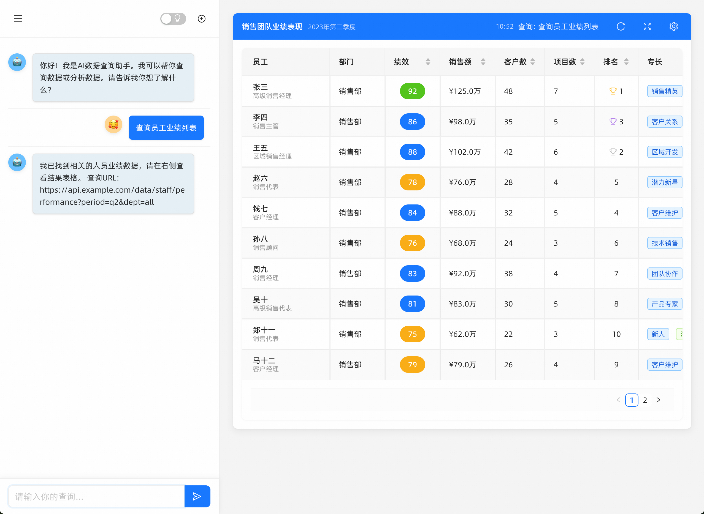

# 开发日志

## 2025-05-14 - 前端项目初始化与渐进式开发规划

1. **前端开发规划文档创建**：创建了 `doc/frontend_development_plan.md` 文档。
2. **前端项目初始化**：创建了 `apps-frontend` 目录，使用 React 18 + TypeScript + Ant Design 5 + Vite。
3. **基础组件开发**：创建了 `App.tsx`，添加了样式文件 `App.css` 和 `index.css`。
4. **本地开发环境配置**：安装了项目依赖，启动了开发服务器。
5. **后端项目调整**：添加了数据库、MyBatis Plus配置。
6. **文档工作**：新增 README.md，添加了 .gitignore 配置。
> 下一步：按照前端开发规划文档中的阶段二目标，开始引入路由和多页面结构，并实现与后端多个服务的集成。

## 2025-05-13 - 项目初始化与基础配置

1. 使用 spring-initializr 创建了三个应用 `app1`, `app2`, `app3`。
2. 创建了 Maven 父模块 `apps-parent` 及三个子应用 `app1`, `app2`, `app3`。
3. 在父 POM 中统一管理了核心依赖，并设置 Java 版本为 17。
4. 将配置文件转换为 `yml` 格式，配置了端口、应用名及 Actuator。
5. 初始化了 Git 仓库，创建了 `.gitignore` 文件，并完善了 `README.md`。
6. 添加了 `logback-spring.xml`，配置了日志输出。
7. 成功执行了 Maven 命令安装了父 POM 及所有子模块。

## 2025-05-18 - 原型搭建
搭建了原型，如下，前端部分完成基本骨架的搭建

> 下一步:与后端服务对接

## 2025-05-19 - Elasticsearch 集成与搜索功能实现

1. **依赖配置**：在 app1-service 模块引入 Spring Data Elasticsearch 和 Elasticsearch Java API Client，增强对中文搜索的支持。配置 IK 分词器以优化中文搜索效果。
2. **领域模型**：设计 `PersonDocument` 文档类，使用 `@Document` 注解定义索引，`@Field` 注解配置字段类型。针对搜索需求分别设置不同用途的字段，如用于全文检索的 Text 类型字段和用于排序的 Keyword 类型字段。
3. **查询工具**：开发 ElasticsearchQueryBuilder 工具类，封装查询 DSL 构建逻辑。实现多字段匹配、精确匹配、范围查询、前缀匹配和布尔组合查询等功能，优化查询结构提升搜索准确度。
4. **服务抽象**：创建 ElasticsearchService 通用接口和 `BaseElasticsearchServiceImpl` 抽象类，统一定义索引管理和文档操作方法。实现 `PersonDocumentServiceImpl` 业务服务类，提供特定领域的搜索和操作功能。
5. **测试验证**：编写 `ElasticsearchServiceTest` 测试类，全面测试索引管理、文档增删改查和复杂查询功能。优化测试过程的日志输出，提供详细的操作反馈，便于调试和验证。
6. **性能优化**：通过 `application-test.yml` 配置 ES 连接参数和性能选项。调整索引刷新策略、连接超时时间和分片设置，保证测试环境的稳定性和开发环境的灵活性。
7. **代码质量**：重构 `ElasticsearchQueryBuilder` 实现，提高代码可读性和可维护性。设计 `BoolQuery` 构建器简化复杂查询的构建。为所有类和方法添加详细的 JavaDoc 注释，明确用法和参数要求。

> **下一步**：计划实现聚合分析等功能